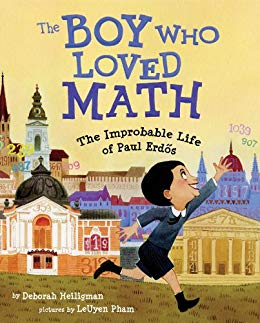

# Attention spans for math and stories

2019-03-26

There was a [MathOverflow
thread](https://mathoverflow.net/questions/281447/mathematical-games-interesting-to-both-you-and-a-5-year-old-child)
about mathematically interesting games for 5–6 year olds. A lot of the
discussion revolved around how young age 5 really is, and how we should temper
expectations because we don't really remember what it's like to be 5. In
response to an [enormous answer](https://mathoverflow.net/a/281475) by
Alexander Chervov, user LSpice quipped, "‘Daddy, daddy, let's play another in
the infinite indexed family of perfect-information draw-free cheap-to-construct
two-player games!'" That being said, [Martín-Blas Pérez Pinilla's "sprouts"
game](https://mathoverflow.net/a/281473/6429) piqued my interest to find
optimal strategies.

Most abstract logic games that are interesting to mathy folks are only
interesting when you start asking questions beyond core gameplay. For example,
the game [Set](https://www.setgame.com/set) is interesting when you ask, "how
many cards can you have with no set?" or similar [tricks to determine the last
un-dealt card](https://jeremykun.com/2018/03/25/a-parlor-trick-for-set/) in a
deck just by viewing the remaining board. These have little to do with skill at
playing the game. I started playing chess around 5–6 years old, but
realistically I was probably doing it to spend time with my dad and get
approval for making correct moves.

For children to exercise mathematical reasoning skills—beyond the sort of basic
motor skills and planning that characterize typical games—they have to be
motivated.

People with an eye for science, people who in their adulthood marvel at all the
splendor of nature, often neglect that at age 5, there is one simple thing that
kids embrace with all their being, justification-free, which can be used as a
vessel for abstract reasoning: storytelling. Be good at storytelling.

A few years ago, my cousin's daughter was 5 years old. I'll refer to her as
Anna. Anna is of Hungarian descent, lives in Germany, and speaks functional
English. So naturally I sent my cousin the book "The Boy Who Loved Math."

[The Boy Who Loved Math](https://www.amazon.com/gp/product/1596433078/ref=as_li_tl?ie=UTF8&camp=1789&creative=9325&creativeASIN=1596433078&linkCode=as2&tag=mathinterpr00-20&linkId=7ce4123f09c9a4bc073bd29c3d9ad000)

It's a story about Paul Erdos, the famous Hungarian mathematician who was also
the most prolific mathematician of all time. The book is in English, about a
Hungarian boy, and involves a strict German nanny. Naturally, Anna loved the
book because she had someone to identify with her multiplex identity.

At its most mathematical, "The Boy Who Loved Math" explains what a prime number
is, and Anna learned it immediately. My cousin told me about how one day they
were listening to the radio in the car, and a game show was playing where the
prize-winning question was (I paraphrase), "What is the name for a number that
has only itself and 1 as a factor?" The contestant on the radio couldn't
answer, but Anna pipes up, "That's easy, it's a prime!" She could seamlessly
learn a concept taught in a sequel, even though, to the best of my knowledge,
she had no interest in math before this.

My cousin knew her daughter was bright, but was at a loss for what to give Anna
to occupy her mind. Simply having the idea of a prime number wrapped up in a
story about someone like her was enough to pique her interest.

----------------------------

This story has nothing to do with math, but has a lot to do with storytelling.

I worked as a day camp counselor for a few summers in high school and college.
My main age group was 5-6 year old boys and girls. It's a lovely age group
because they're old enough to understand complex ideas, but too young to
directly challenge you when you lie to them. And I lied like the wind.

My shtick was to tell the kids that the summer camp was a secret agent training
camp. All the counselors were former secret agents that had retired and were
now training the next generation. By the end of each 3-week session, most of
the kids figured out that it was make-believe, but it was _fun_ make-believe
and there was just enough to keep it plausible.

The crown jewel of this act was that it was an infinite time sink. Often
enough, our schedule had us playing an hour of field hockey followed by an hour
of tennis in 95 degree heat (even in normal weather, a 6 year old won't have
more than 15 minutes of tennis in them before they get bored or frustrated by a
lack of hand-eye coordination). On such hot days, I would end the activities
early and have the kids gather around in the shade to regale them with a tale
about a "mission" another counselor and I had embarked on in our long, storied
career.

The formula was pretty simple:

1. Pick an evil boss: Doctor Euler.
2. Choose an exotic locale for a base: inside an iceberg.
3. Pick an "element" (sand, grass, dirt, mud) for the evil boss's henchmen to
   be built out of (so that we can "kill" them without resorting to gratuitous
   violence; guns don't work on grass monsters).

As you can tell from the name of the evil boss, I liked to slip in math names
for things. Turns out, mathematicians have terrifying and authentic names for
evil geniuses: Doctor Euler, Doctor Tychonoff, Doctor Lagrange, Doctor Gauss.
The headquarters of the evil Corporation was called the Vector Space. Our
organization of secret agents was the Free Group. You get the idea.

The stories were almost entirely improv. I provided the setting and the names,
and then threw in random obstacles: a fork in the road, an Indie-esque boulder
rolling toward you, etc. Then I would pause the story, and ask the kids: what
would you do in this situation?

To be clear: I had _no idea_ where the story was going. But the kids took it so
seriously, they would craft all kinds of ideas, and eventually I'd pick one and
say, "that's _exactly_ what we did." I get a free story idea, the kids get
validation for thinking logically or creatively, and they become part of the
story. They would even add unexpected details. When I introduced "Doctor Euler"
(a German name pronounced "OY-lurr") one kid squealed, "_Ooooh!_ Is his hair
all _oily and green?!_" Of course it was.

The next best part of the charade was that it incentivized participation in the
camp activities. For example, the camp rented a climbing wall that some of the
kids were afraid to attempt. So the next day I had a tale about a mission to
infiltrate Doctor Archimedes's cliffside lair, and the only way in was to climb
up from the bottom. The next time we did climbing, everyone gave it a shot.

How could I justify the drama activities to the campers? On one mission I had
to infiltrate a party in which the top executives of the evil corporation were
meeting. I had to act well to play my part and not raise alarms. For sports,
physical strength and agility. For arts and crafts, MacGyvering devices on the
fly.

If I had wanted to, I could have easily incorporated learning math as part of a
plot line, and used it to reinforce the importance of math. When you're
invested in a story, learning and thinking are natural and easy.

---------------------------------

Stories don't just get people interested, they get them invested in their own
abilities. They make them feel welcome. They can make a frustrating or
uncomfortable event tolerable, or even good in retrospect.

I was a Boy Scout, and when I was 16 I was a senior patrol leader. This
basically meant I ran the weekly meetings and helped organize outings. The
youngest scouts in the troop were 10 years old, and many of them felt out of
place as the youngest members. On certain long outings with no young scouts
attending, they might get homesick or find difficulty making friends.

One strategy I employed to make them feel more welcome—emulating a scout who
did this when I was younger—was to invent outlandish, Chuck Norrissian tales
about their feats of bravery and strength on these outings. The meeting after
the outing, I'd close the meeting by relaying the tale to the troop (doubling
as an advertisement for how fun the outings were), and bestowing a relevant
nickname on the scout.

For example, on a snow camping trip one scout didn't bring proper clothes, so
his feet were soaked and he was cold and miserable. But his story involved an
epic snowball fight during which he single-handedly defeated all the dads and
other scouts, kicking off his shoes and going barefoot because shoes slowed him
down. By the end, his feet were literal blocks of ice, and so he went to stand
on top of the fire to thaw them. He got the nickname Ice Pack, and the other
scouts thought he was pretty cool.

It turns out, fear and pain can be amplified or diminished depending on the
stories we tell. [Some researchers in
Chicago](https://www.npr.org/2018/12/16/676188220/how-to-make-sure-your-math-anxiety-doesn-t-make-your-kids-hate-math)
studied how parents fear of math can be endowed in the child when they say
things like "I don't like math,"—in fact, saying "it's okay if you don't like
math because I don't like it either" is even worse than completely ignoring
it—but math anxieties can be counteracted by normalizing it in family life. The
NPR article linked above downplays the technique, but in the study they had
parents _read bedtime stories_ involving math to their kids, and then ask the
kids questions about the math in the stories.

With all the ways I have used storytelling in my life, it's obvious that
storytelling was crucial here. I doubt simply giving a kid exercises to do
before bed would have worked. A story welcomes you to participate, to play out
what would or could have happened in your mind. You think about a good story
later, recounting its steps in your head and imagining yourself in the middle.
That behavior is the first step toward mathematical inquiry, where a good
problem nags at you to explore it further. The story helps you feel you belong,
and if you belong around math, it won't seem scary even when it's hard.

---------------------------------------

In my view, storytelling is the key to any mathematical encounter. For kids,
and for people for whom math is foreign and scary, the storytelling is never
about the math. Rather, the math delightfully grows out of the story. Simple
examples reign supreme, and you keep prompting the listener with, "look at this
curious pattern," and, "why does this always work?"

As you become more comfortable with math, the emphasis of a good story
transitions to having the mathematical objects take center stage. They are the
actors, their surprising behaviors drive the plot, and the theorems and proofs
are the punchline, and the generalization of the proof technique is the
epilogue cliffhanger.

What's really needed is more story-focused content between basic number sense
and undergraduate level math. YouTube channels like
[Numberphile](https://www.youtube.com/channel/UCoxcjq-8xIDTYp3uz647V5A)
(particularly [Tadashi Tokieda's
episodes](https://en.wikipedia.org/wiki/Tadashi_Tokieda) that explore curious
toys) are a fantastic invitation. More could exist in various forms,
particularly those that transition from these delightful introductions to
deeper, more complete theories while still holding on to the stories.

And to have good mathematical content revolving around stories, mathematicians
and mathematical experts should learn to tell stories well. I think this is
difficult, but there's demand for it when it's done well—as Numberphile has
made completely obvious.
