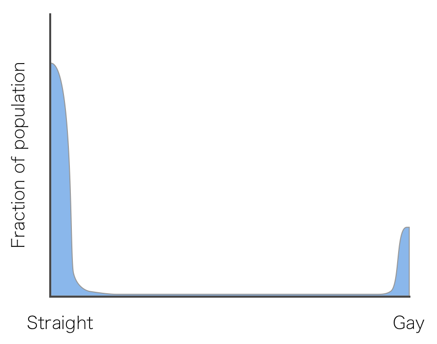
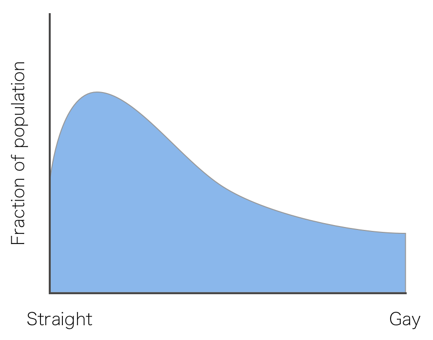
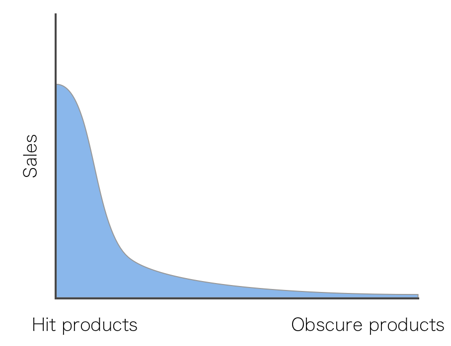
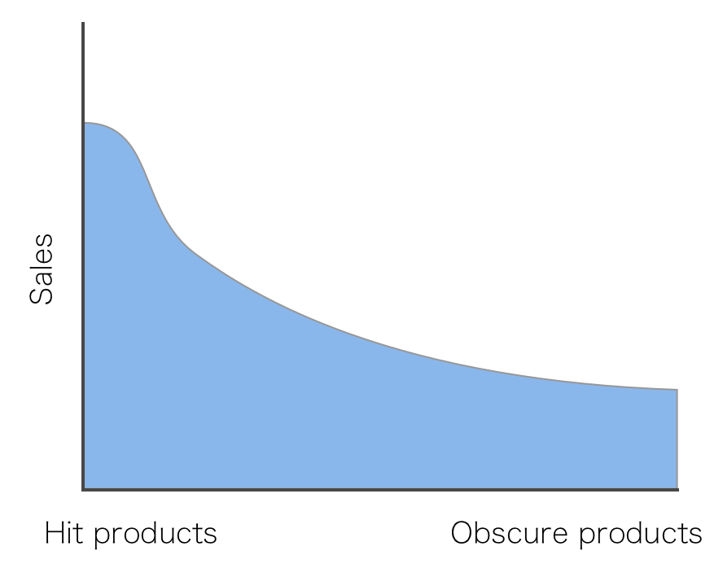

# Mathematics can help clarify liberal arts

2016-04-18

I had a long conversation with a feminist friend of mine the other day about
sexuality. People have a lot of strong feelings about this topic. But rather
than form ranks and brace for impact, my mathematical inclination drove me to
pin down exactly what her claim was. Precise, logical rigor was what I was
trying to tease out from phrases like, “You’ve been socialized to accept
heteronormativity.”

I would ask questions like, “How do you know that I’m not just normal?”
Whereafter I learned that “normal” is offensive. And I agree, at the very
least, that “normal” is the wrong word to use in a technical discussion because
(1) it’s overloaded both in math and real life and (2) if I’m trying to tease
out definitions from other people, I shouldn’t be allowed to use a word that
I’m refusing to define.

But faux pas aside, I was surprised by the clarity of what came out of the
discussion, and how neatly it fit into existing mathematical parlance. Here’s
what we distilled.

First, the claim is that existing ideas about sexuality rest on the assumption
that sexuality is a binary property: gay or straight. Or maybe a multi-valued
property if you include bisexual and asexual, but for the sake of simplicity
let’s just stick with the two. The point is that it’s culturally treated as a
discrete random variable.

One feminist conjecture is that, to the contrary, sexuality is a continuous
random variable. Now, again for simplicity I’m using the words “random
variable” in the precise statistical sense, so I’m not saying sexuality is
random or that it necessarily changes. Either way, I don’t think that anyone
finds it hard to agree that sexuality is probably a continuous distribution.
The reason is because you don’t make any radical claims if you don’t say
anything about the shape of that distribution. That is, you can essentially
embed a discrete distribution inside of a continuous distribution with few
outliers in between. The picture would look like this:

The meat of the contentious claim is in the shape of this distribution. In more
detail, the feminist claim is:

> People think the distribution is exponential, with gay being the tail, but it’s
> actually a fat-tailed distribution, or maybe even close to a uniform
> distribution.

In this world, the picture would look more like this:

Another way to say this, though it’s couched in some jargon I find
qualitatively accurate enough but not quantitatively useful, is that “most
people are on the spectrum.” It seems like the further liberal you go, the
further your conception of this distribution tends to a uniform distribution
where the population is equally spread out on the spectrum. Uniformity is my
feminist friend’s view. I have specific reasons why I disagree with her, but
that is a different discussion.

It was curious that in this conversation with my friend, I teased out this idea
by appealing to a math talk I attended about Amazon.com sales. In the context
of Amazon, the analogous feminist conjecture is a theorem! Here’s what I mean
by that. Amazon displays on their front page all of these Top 10 lists. New
York Times Bestsellers, highest grossing, highest average rating, etc. And if
you weren’t studying the data very closely, you might come to the reasonable
conclusion that Amazon makes most of their money by selling hits. The reason
they sell other, “weird” stuff, the obscure products and special interest
paraphernalia, is maybe because they can’t predict the next big hit. So they
sell everything just in case.

In other words, a priori you might conclude that there are maybe a few people
who buy weird things, but most people are “consumer-normative.” The picture is

In reality, the opposite is true. Amazon.com makes most of their money from the
sale of “weird stuff.” This says two things: that if products are on a spectrum
from popular to obscure, then the distribution of sales has a fat tail.

Even though hits are more popular individually, the total mass of sales from
obscure products far outpaces that for hit products.

But moreover, it says that most people have obscure interests. In fact, if you
get down to the numbers the majority of people who shop on Amazon purchase
relatively obscure things. And this translates to many millions of dollars of
revenue for Amazon. That’s what is meant informally by a “fat-tailed”
distribution. (The inner mathematician in me is dying to stress I’m abusing
“fat-tail” by applying it to the sexuality distribution. If it’s bothering you,
just accept that I’m trying to say something about the shape, and fat-tailed is
an evocative term far more expressive than the technically correct
alternatives. Okay enough of that.)

The Amazon example is part of why I don’t feel all that opposed to the
conjecture that sexuality is a fat-tailed distribution. I already know, with
data to back it up, that people are far more likely to have a few obscure
interests than only mainstream interests. Whether this also applies to
sexuality, and how a specific individual should behave if it does, is a
completely different question. All I’m saying here is that the conjecture is a
reasonable one to make. It agrees with existing facts.

What was so amazing about this conversation was deeper than my clarity about a
particular feminist claim. It’s that now I can explain it succinctly and
precisely to anyone else who speaks the language of mathematics. The phrase,
“Feminists believe sexuality is a fat-tailed (or maybe even uniform)
distribution,” encapsulates the entire conversation, and serves as an excellent
starting point from which to expand.

A principle that’s far dearer to me than promoting liberal or conservative
values is honest and clear discourse. I want to facilitate the sharing and
building of wisdom, and hinder bad science and arguments based on fear,
intimidation, pride, and idolatry. I want to burn red herrings with fire. I
want people to engage each other constructively and think critically about
their problems. Even if I don’t agree with the outcomes. Maybe certain
subgroups of “stereotypical male nerds” find feminism impossible to comprehend,
and maybe even those who do understand feminism nevertheless disagree with it.
But if translating the discussion to mathematics can clarify it and drive
people to engage the ideas on their own merits, then that’s precious to me.
