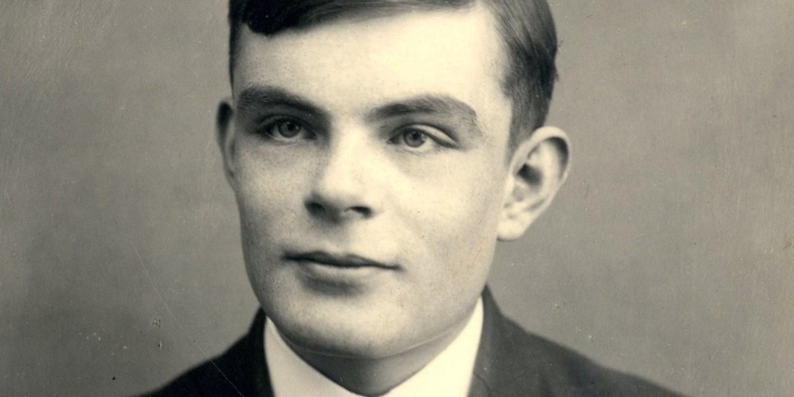

# An open letter to Invisibilia

2016-07-15

Hi Lulu, Alix, Hanna, and everyone else at Invisibilia,

I’m writing in regards to your recent episode, “The Problem with the Solution,”
which I thought was fantastic.

However, the beginning part nagged at me a little bit. The part where you
basically set the stage for the mental illness “non-solution solution” by
having the hair-trap guy tell his story and say, “Every problem has a solution!
Try to solve all the things!”

I know exactly why it bothered me, but before I jump into that I just want to
reinforce how great I think Invisibilia is. I don’t want this to come across as
a criticism, but rather as excitement to share cool ideas with you. I need this
caveat because I’m a mathematician. And mathematicians tend to think and speak
in a way that emphasizes consistency, precision, and nuance of language over
things like, whether you come off as an arrogant prick or whether someone’s
feelings are hurt. So again, I love the show, I respect you all for your
fantastic work, and also here are some cool things I like to think about.

My thoughts about this episode culminated in a snarky tweet

> As a mathematician, every time someone says "Every problem has a solution," I
> die a little inside.

It turns out that all mathematicians know that there are problems that cannot
be solved. Period. I don’t just mean the sort of silly, “you can’t divide by
zero,” rules that we’re made to memorize in school (though that is a very
simple example). Rather, I can give you an example of many problems that
everyone would agree would be a fantastic problem to solve, but there is a
mathematical proof that it cant be solved definitively, period.

Here’s my favorite example, which comes from a field called “theoretical
computer science.”

Computers are a big deal. They’ve revolutionized the world we live in, and the
software engineering discipline accounts for trillions of dollars of value
across all industries that use it worldwide.

Consequently, bugs in computer programs regularly result in millions of dollars
of lost value. From that perspective, it would be extremely useful if we could
design computer programs that can automatically tell whether the programs
engineers write have bugs or not.

Turns out, this problem can’t be solved. And you can prove it mathematically.
In fact, this problem was known to be unsolvable before computers were
invented! It’s one of the crowning achievements of Alan Turing, along with
cracking Nazi codes in WWII and recently being portrayed by Benedict
Cumberbatch in a movie. People also tend to focus on his persecution as a gay
man, which was bad, but that focus often comes at the expense of spreading his
intellectual ideas, which I think is worse in some ways. Turing is the
forefather and the epicenter of the intellectual revolution of our time, the
transition to thinking about problems in terms of algorithms and computing.

Alan TuringI could go into a detailed exposition about why the
computer-bug-finding problem is unsolvable, and I think that it’s a really
interesting (albeit technical) story. But instead I’ll just give the sort of
philosophical pseudoscientific reason, which boils down to the fact that the
expressive power of computer programs as a whole is too vast for a single
computer program to comprehend.

On top of that, Alan Turing is famous for this “thesis” that was named after
him and another influential mathematician Alonzo Church. It’s called the
“Church-Turing thesis.” What it says is that the powers and limitations of
algorithms is a universal feature of computing.

That was unclear so let me try again: computations happen in lots of different
ways. Computers crunch numbers, cats compute when exactly to pounce on an
unsuspecting mouse, you compute whether you want a grande or a venti chai latte
this morning. Scientists have even noticed that soap bubbles are effectively
computing things as they float around. So when I say “computing” in this
context, I really just mean decision making by any process that has some sort
of principle (even random choices count).

The Church-Turing thesis says that anything which can be computed, can be
described by an algorithm. That is, if it can be done, it can be done on a
computer, so long as that computer is big enough and has enough time to run.
And vice versa, any problem that cannot be solved by algorithms also cannot be
solved in general.

And if you believe Turing’s thesis—at least, you can’t point to any evidence
against it because nobody has found any—if you believe that the human mind has
the same fundamental limitations as a computer program, you get some
interesting consequences.

Take the justice system, for example, which essentially encodes a computation
for deciding legality. As we’ve seen those processes can draw out for unbounded
lengths of time, with complicated logic, appeals, and reversed decisions
after many years. If the computations that can be expressed by the legal
system are sufficiently expressive, then it follows that (1) no computer
can definitively reason about the legality of an action, and (2) no human
can definitively do so either!

Admittedly, it would take an awkward contortion of the legal system to, say,
multiply two numbers. But the problems that result from over-expressiveness of
laws recently bit a group of people in the butt, and collectively cost them
over 50 million dollars. It was this company called the DAO, which wrote a
program to define the rules by which the company operates. It wasn’t possible
for the DAO founders to definitively say there were no bugs in the rules of
their business, or whether some user’s bad behavior would result in a loss
of money. And wouldn’t you know, their business rules were used against
them and they lost millions. It was colloquially called a “hack,” but the
“hacker” simply played by the rules.

Stepping back from all this, what’s most astounding is how invisible
mathematics is to most of the world. And how a huge part of mathematics isn’t
just solving equations, but rather taking some invisible pattern you discovered
in your head, and getting that insight into another person’s head so they can
understand it just as lucidly as you do. That’s how mathematics grows in
practice. It’s this evolving network of conversations, drawings, and
gesticulations. Mathematics is like this thick underbrush that takes a machete
to get a peek inside. It grows and expands while some branches whither and die.
But a select few offshoots slowly but surely pierce through the canopy into the
sunlight, and their fruits change the world.
