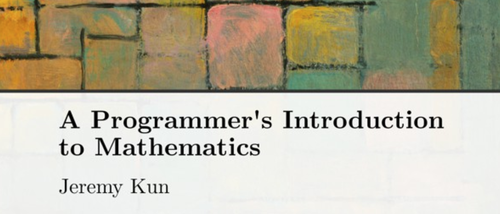

# On self-publishing "A Programmer's Introduction to Mathematics"

2018-12-08

Over the past four years I've been writing a book, [A Programmer's Introduction
to Mathematics.](https://pimbook.org/) It teaches someone with programming
knowledge and experience how to engage with mathematics. I can achieve this
goal largely because of the implicit overlap in the content and ways of
thinking between math and programming. Despite that, there is no smooth bridge
from one world to the other—a bridge that explains the unfamiliar parts and
focuses on the important concepts, while leveraging programming to demonstrate
applications.

Until now. If you're a programmer who wants to really grok math, [this book is
for you.](https://pimbook.org/)

In this article I'll explain how I wrote and self-published the book.

The bottom part of the book cover

# Assembling Content

Having written technical blog articles for eight years, the writing process
felt natural. I wrote about a third of the book within a few months after
starting, and I was 100% happy with the content—though not the style, cf.
"Editing."

I could have kept writing, but I knew I had to constrain myself to something
that could fit in a reasonable-sized book. I aimed for 300 pages (final book is
about 375 pages of content), but by the time I realized that I needed to cut
some content, I had already written about 100 pages.

This first 100 pages covered the three chapters "Polynomials," "Sets," and
"Graphs." I wanted chapters on calculus, linear algebra, optimization,
probability, group theory, complex numbers, and differential equations. But
polynomials, sets, and graphs are the easiest chapters content-wise. These
other chapters would be necessarily longer. I wanted to keep each chapter to
~50 pages. Including all the chapters would push the book above 500 pages. I
also didn't want it to be too dense (I could cram linear algebra into 50 pages,
if I leave out the exposition that actually makes my book worth reading; screw
that!).

This process of cutting out entire chapters, and whittling each remaining
chapter to its core while still providing useful high-level insights, proved to
be the most challenging part of writing.

This resulted in glaring omissions. The book has a chapter on calculus, but
omits integration. Instead, the calculus chapter focuses primarily on
derivatives and Taylor series. This fits largely with my personal
experience — Taylor series are more applicable to math (and the kind of math
that shows up in programming) than computing convoluted integrals. Taylor
series also had use in later chapters for optimization, big-O notation, and
physics.

Cutting integration was a deliberate choice. The general ethos of approximation
is what I want the reader to internalize, and once that's done learning why
integration makes sense is much easier. I felt this way about most topics I
omitted. Once you have a strong understanding of sets and the basic terminology
around combinatorics, the average book on discrete probability is more
digestible. Perhaps that is wishful thinking, but I had to make compromises
somewhere or I'd never finish the book.

Instead of trying to cram every subject in the book, or guess the best topics,
I chose topics that crystallize essential skills and patterns, which I could
also demonstrate with code. Then, with ample exercises to go out and explore
math beyond the book, the reader will build the cognitive skills to learn
whatever math topic they desire.

I had to do some extra research for the book. While graphs and eigenvalues are
readily in my brain, other topics I had learned and long forgotten. Hyperbolic
geometry was one (specifically how to compute in the hyperbolic plane), I had
to refer to a few physics books about the typical way they present mathematical
models for waves, and I admit I did gain a newer and more complete
understanding of the core definitions of multivariable calculus.

As I repeat in the book, every time you re-learn a subject, you gain new and
useful insights.

# Typesetting (LaTeX in vim with latexmk)

The entire book was typeset in LaTeX.

I was able to jump into the writing without thinking too much about formatting
because I started with a copy/pasted [book template from
Overleaf](https://www.overleaf.com/gallery/tagged/book). I ended up changing
that template quite a bit (for some reason, it mixed serif and sans-serif
text?), mostly simplifying it, configuring code samples, exercise lists (using
the [exercise package](https://ctan.org/pkg/exercise?lang=en)), and theorem
environments. If you ask me later, I will happily upload these structural TeX
files so they can be reused, but be aware I'm not a TeX expert, so it's
probably better to start from a template.

I stored all my files on Dropbox. In 2014, that made sense for me, as I was
just starting to use git in earnest. If I were to do it again today, I'd do it
in git on principle, but there were no major drawbacks to storing on Dropbox.

Each chapter is in a different file, and no TeX file is longer than about 3k
lines. At 80 chars per line, the entire book is almost exactly 20k lines
(including all TeX annotations in the chapter files, like index markers and
figures).

I wrote the book in vim, and used latexmk to automate compilation ([more
details](https://jeremykun.com/2015/01/10/my-latex-workflow-latexmk-sharelatex-and-stackedit/)).

At the end of the book, I realized I wanted an index, and I went through the
entire book just hunting for places to put index markers. LaTeX will build an
index for you automatically, but you have to tell it precisely what location to
index, and what word refers to that location. This worked out quite nicely for
some things; for example, I indexed the location where I define each bit of new
notation. It was also a slog.

Finally, at the very end I did another pass over the book using
[chktex](http://baruch.ev-en.org/proj/chktex/) with some slight configuration
to tell it to ignore code listings, texttt, etc. I learned a few new things
about TeX when doing this, but it probably wouldn't have killed me to skip that
step.

The cover art is an early 1900's painting by Piet Mondrian. I did the cover
organization and layout using [Sketch](https://www.sketchapp.com/). One hiccup
is that Sketch doesn't export pdfs in a way that you can choose a resolution
(it used 72ppi by default), so I had to use a different tool (ImageMagick
convert CLI) to adjust the resolution.

Editing During writing, I read each chapter draft roughly three times. After
writing the whole book, I read it cover to cover twice.

I made many embarrassing mistakes, and I fixed the ones I found, but I bet
there are still mistakes in the book. If you find any, submit an erratum at
[pimbook.org](http://pimbook.org/).

During early edits I rewrote large portions of each chapter. I struggled to
achieve the right the pace and density for the first few chapters. I wanted the
book to have a ramp. The earlier chapters should be accessible to anyone
without—as I put it mildly insensitively—a phobia of fractions. The goal of
those chapters is to introduce notation, to wean readers onto cultural
expectations like writing down examples, to lay out basic definitions and proof
techniques, and to get past that inevitable part of reading math where your
eyes glaze over looking at a formula.

In addition to proofing the book myself, I sent it out to basically anyone who
would ask for it via mailing list. I trolled Hacker News posts where
programmers griped about math and slipped in an advertisement, and many of them
contacted me via email and some provided useful feedback. I also gave early
rough drafts to any of my friends who wanted to take a look, and many provided
good feedback.

However, one glaring omission was a thorough, paid technical review of the math
and programs. I struggled to find someone who would commit to reviewing more
than one chapter. I think in part it was because friends and colleagues didn't
want to start a business relationship and be on the hook for a friendship or
something (I would never end a friendship over this!). Finally, I got in touch
with an old classmate from my time in the Budapest Semesters in Mathematics who
agreed to review two chapters that I was particularly concerned about. If I did
it again, I'd work harder to find multiple technical reviewers and get better
coverage in that regard.

A few days after publication, it was already clear that I should have spent
more time editing. I had somehow skipped my final spell check on the Sets
chapter, and an early reader submitted a number of typo corrections. Rats.

But around a month before my ultimate publication date, I was just exhausted by
all the editing. I felt that I was ultimately OK publishing it with some minor
imperfections, and that I was proud of it in its current state. And that was
how I decided I was done editing.

# Self-publish vs. publisher

Over the years I worked on the book, I had discussed a book deal with a few
publishers, including O'Reilly. What I took away from those conversations was
that the added work of working with a publisher, and the added deadlines,
wasn't worth the benefit.

The offer was something like "$5k advance paid now, then 10–15% royalties on
sales after those royalties pay back the $5k advance." What I'd get in return
was a copy editor, the brand, the printing and distribution channels, and the
advertising.

There were a few catches. Most non-academic publishers won't let the author
write in LaTeX (and for mathematical typesetting there is simply no other way),
so I was told multiple times I'd have to convert my existing 150 page draft
into Word or OpenOffice format.

If that alone wasn't a deal breaker, some publishers told me that I was on my
own for finding technical reviewers. Couple this with my difficulty meeting a
deadline (see "Timing"), and I felt the publisher would add more stress than
support. I also knew in the back of my head that they'd force me to change the
style of my book in a number of ways, and that added some uncertainty.

I had built up an audience from [my blog](https://jeremykun.com), with a
mailing list of 1,000 people (closer to 2,000 by publication), so I felt I had
a brand and decent distribution. I was confident I could typeset the book
professionally enough.  The editing wouldn't be perfect, but I could live with
that.

Most importantly, I knew about on-demand publishers like CreateSpace (now
Kindle Direct Publishing), since I worked at CreateSpace part time as an
undergraduate.  CreateSpace allows you to upload a book interior as a pdf and a
cover, and "publish" instantly. Then whenever someone orders the book on
Amazon, they print it and ship it that day. That covers distribution. I can
sign up for Google Ads and schedule promotional talks and interviews. I can't
print, store, and ship books to customers, full stop. So CreateSpace was
essential in my choice.

CreateSpace/KDP also gives much better royalties, around 40% of the list price
for a paperback. Self-publishing also gave me the flexibility of choosing a
venue to sell the ebook. A friend of mine published a book using Gumroad, and
they seemed pretty good, providing about 95% royalties on sales. The ebook was
simply a pdf download.

# Code repository, website, and referenced material

Along with the book I had associated programs, some of which were very long,
with the important bits showing up in the book itself. So I needed a
[website](https://pimbook.org) and a [GitHub
repository](https://github.com/pim-book) to allow readers to see the full code.

I made the [website](https://github.com/pim-book/pim-book.github.io/) in
[Hugo](https://gohugo.io/), which was easy and pleasant. Although, most of the
work was in figuring out how to make a one-page site, since most Hugo tutorials
and templates are for blogs.

The book code was written in Python 3.x, and naturally it has a full test suite
with [Travis CI](https://travis-ci.org/) and [Coveralls](https://coveralls.io/)
running against the code repository to ensure it stays healthy. I already
received one pull request for a version incompatibility I overlooked.

I wrote the early chapters at a time when I had been competent in Python, but I
hadn't used it professionally. By the time I finished the first draft, I
decided I should go back and rewrite all the early Python code so it conformed
to better engineering practices docstrings, more modular organization,
standardized test framework, etc. I would have liked to use more modern Python
features like dataclasses and type hints, but I felt they were too new and
might have thrown off some readers who are either used to Python 2 or new to
Python entirely. Type hints in particular add a lot of noise.

I also wrote an [interactive
visualization](https://pimbook.org/demo/index.html) in [d3](https://d3js.org/)
for the eigenvalues chapter, which is hosted on the book's website.

# Timing

I worked on this book for four years. During that time, I finished a PhD
thesis, got married, moved across the US, and switched jobs twice.

Periods of time during which I completely lost steam. I got bored, or hit a
wall trying to decide what topics to cover or what applications to use. I went
out and made new friends, picked up new hobbies like rock climbing and craft
cocktails, played video games, went back to blogging, and worked on random side
projects.

I like to tell myself I could have finished the book in a year if I worked on
it full time. But to be honest, I think the book turned out better with the
wait. I write better software now, and I have a stronger understanding of the
industry since I've been out of graduate school. And my writing style
continually improves.

# Pricing, customers, sales

I listed the book at $35 for the paperback and $20+ for the ebook. (i.e., $20
or pay what you want above that) The royalties worked out to about $15-$18 per
sale. I originally thought I should sell the book for cheaper, but I undersell
myself and so I looked around at what other books were selling for, imagined to
myself what I thought was a fair price, and added $10.

Initial sales have been great. I set a baseline for myself that if I couldn't
sell a thousand copies of the book, then I would consider it an abject failure.
At the time of this writing I've sold more than 2,500 copies, with about 60% of
that being paperback, and the majority of the sales coming from the US. More
importantly, initial reception has been heartwarmingly positive. I can't wait
to see how people feel after they've read the whole book.

Many folks have been asking for a format of the ebook that is compatible with
Kindles (epub or mobi format). They want to resize text and such. Sadly, I
don't know of any good way to do this that is cost effective for me and still
produces a book with the quality I expect. In particular, every website I
looked that that showed how to put math formulas in epub/mobi produced results
that looked awful. And you have to manually rewrite all the offset formulas so
that they fit within the expected form factor. Six inches minus margins is
quite small for equations! I'm sure there is a way to engineer it, but I don't
have the time to do it myself. I'd much rather be writing another book.

Two customers have asked for "refunds" so far related to the ebook format, and
I've gotten a handful of odds-and-ends requests for other bits of customer
service and accessibility. A few people have asked if it will be available in
other languages (Spanish and Chinese, so far). I'm more than happy to address
customer concerns it if it's not too much work, but a major undertaking like a
translation will probably not happen for a little while.

# Next up: book tour

Finally, I'm starting to organize a series of talks and interviews to promote
the book. I can talk about learning math as a software engineer, about cool
math stuff on its own, or even about the process of self-publishing with all
the nitty-gritty typesetting.

If you want to coordinate, please email meat book@jeremykun.com.
